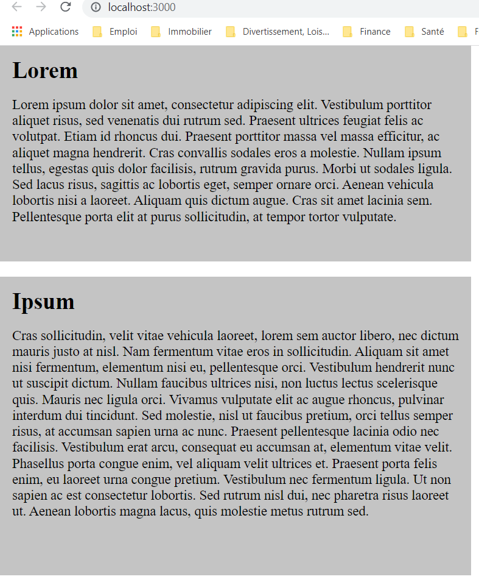

# Lorem Ipsum

## **Création d'une application [React](https://fr.reactjs.org/) - Projet Front-End**

 Exercice réalisé dans le cadre du [Bootcamp "Le Reacteur"](https://www.lereacteur.io/) 

**Objectifs** :

- Initialiser un projet [React](https://fr.reactjs.org/) (via npx create-react-app my-app)
- Créez un projet [React](https://fr.reactjs.org/) (via create-react-app)
- Nettoyer le projet initial (src/App.css, src/index.css,src/logo.svg, src/App.js, src/App.test.js, src/setupTest.js, src/reportWebVitals.js)
- Créer un composant
- Transmettre des props (Title ayant pour props name - Description ayant pour props text)
- Appliquer un style (via className)
- Savoir utiliser le [React Developer Tools](https://chrome.google.com/webstore/detail/react-developer-tools/fmkadmapgofadopljbjfkapdkoienihi)
- Respecter la maquette initiale fournie via l'outil [Figma](https://www.figma.com/fr/).
- Respecter l'arbre de composants à créer (App, Content, Title, Description)
- Push son projet React sur [Github](https://github.com/)

**Les différentes étapes à suivre concernant la bonne réalisation de cet exercice** :

- **Etape 1**
- Dans App.js, sans faire de composants pour le moment, réalisez la partie Étape 1 de la maquette
- **Etape 2**
- Réalisez la partie Étape 2 de la maquette.
- Remarquez qu'il s'agit en fait du même composant, seuls le titre et le contenu changent
- **Notes**
- Le premier cadre gris représente un composant Content.
- Le deuxième cadre gris représente également le même composant Content.
- Le composant Content contiendra les composants Title et Description.
- Afin que les 2 composants affichent des informations différentes, vous devrez transmettre des props.

**Vous pouvez retrouver la [maquette proposée](https://www.figma.com/file/Abb4Zi4bzNBiXGxxApRbfz/Lorem-Ipsum?node-id=0%3A1)**

